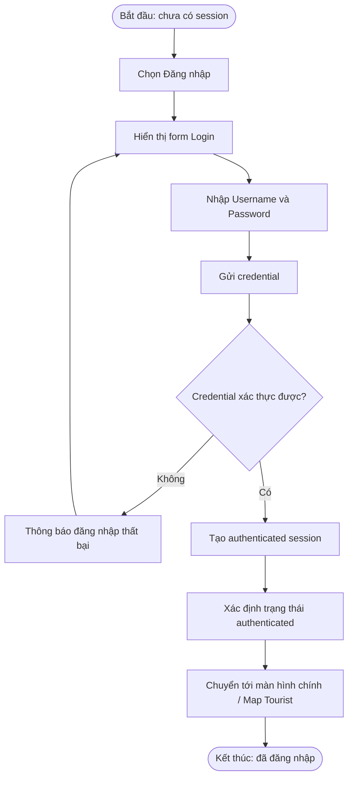

# UC02 — Đăng nhập

**Actor:** Tourist

```mermaid
flowchart TD
    A([Bắt đầu: chưa có session]) --> B[Chọn Đăng nhập]
    B --> C[Hiển thị form Login]
    C --> D[Nhập Username và Password]
    D --> E[Gửi credential]
    E --> F{Credential xác thực được?}
    F -- Không --> G[Thông báo đăng nhập thất bại] --> C
    F -- Có --> H[Tạo authenticated session]
    H --> I[Xác định trạng thái authenticated]
    I --> J[Chuyển tới màn hình chính / Map Tourist]
    J --> K([Kết thúc: đã đăng nhập])
```

**Ngoại lệ:** Credential sai hoặc không xác định được tài khoản Tourist hợp lệ đều không tạo session; cho phép nhập lại.