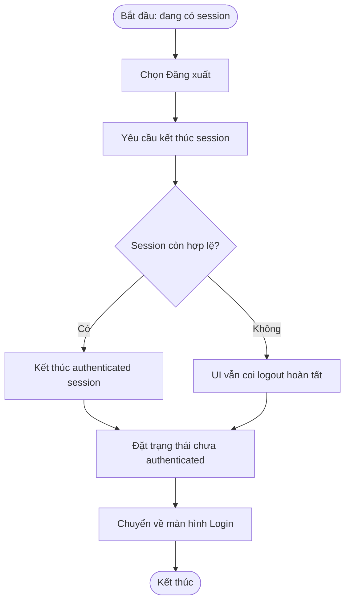

# UC03 — Đăng xuất

**Actor:** Tourist

```mermaid
flowchart TD
    A([Bắt đầu: đang có session]) --> B[Chọn Đăng xuất]
    B --> C[Yêu cầu kết thúc session]
    C --> D{Session còn hợp lệ?}
    D -- Có --> E[Kết thúc authenticated session]
    D -- Không --> F[UI vẫn coi logout hoàn tất]
    E --> G[Đặt trạng thái chưa authenticated]
    F --> G
    G --> H[Chuyển về màn hình Login]
    H --> I([Kết thúc])
```

**Quy tắc chính:** Dù backend không còn session tại thời điểm logout, UI vẫn đưa Tourist về trạng thái chưa xác thực và màn hình Login.