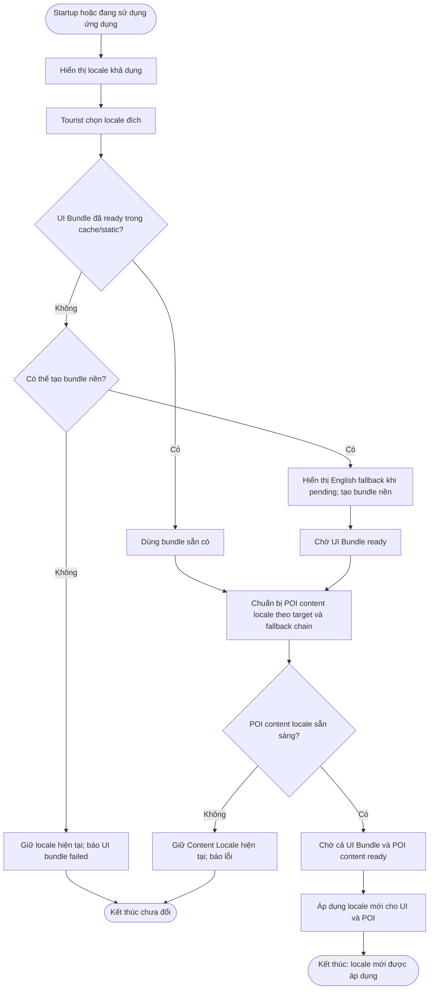

# UC04 — Chọn / Chuyển đổi ngôn ngữ

**Actor:** Tourist

```mermaid
flowchart TD
    A([Startup hoặc đang sử dụng ứng dụng]) --> B[Hiển thị locale khả dụng]
    B --> C[Tourist chọn locale đích]
    C --> D{UI Bundle đã ready trong cache/static?}
    D -- Có --> E[Dùng bundle sẵn có]
    D -- Không --> F{Có thể tạo bundle nền?}
    F -- Có --> G[Hiển thị English fallback khi pending; tạo bundle nền]
    G --> H[Chờ UI Bundle ready]
    F -- Không --> X[Giữ locale hiện tại; báo UI bundle failed] --> Z([Kết thúc chưa đổi])
    E --> I[Chuẩn bị POI content locale theo target và fallback chain]
    H --> I
    I --> J{POI content locale sẵn sàng?}
    J -- Không --> Y[Giữ Content Locale hiện tại; báo lỗi] --> Z
    J -- Có --> K[Chờ cả UI Bundle và POI content ready]
    K --> L[Áp dụng locale mới cho UI và POI]
    L --> M([Kết thúc: locale mới được áp dụng])
```

**Quy tắc chính:** UI bundle và POI content là hai lane riêng; không chuyển một phần nếu content locale chưa sẵn sàng.