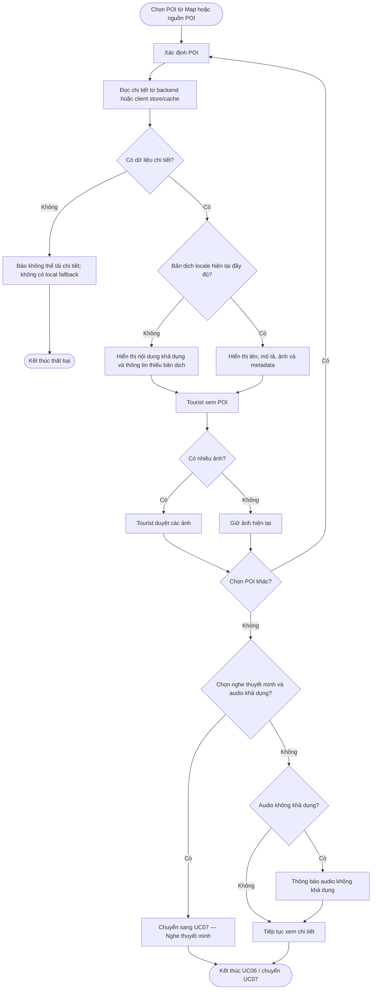

# UC06 — Xem chi tiết POI

**Actor:** Tourist

```mermaid
flowchart TD
    A([Chọn POI từ Map hoặc nguồn POI]) --> B[Xác định POI]
    B --> C[Đọc chi tiết từ backend hoặc client store/cache]
    C --> D{Có dữ liệu chi tiết?}
    D -- Không --> E[Báo không thể tải chi tiết; không có local fallback] --> Z([Kết thúc thất bại])
    D -- Có --> F{Bản dịch locale hiện tại đầy đủ?}
    F -- Không --> G[Hiển thị nội dung khả dụng và thông tin thiếu bản dịch]
    F -- Có --> H[Hiển thị tên, mô tả, ảnh và metadata]
    G --> I[Tourist xem POI]
    H --> I
    I --> J{Có nhiều ảnh?}
    J -- Có --> K[Tourist duyệt các ảnh]
    J -- Không --> L[Giữ ảnh hiện tại]
    K --> M{Chọn POI khác?}
    L --> M
    M -- Có --> B
    M -- Không --> N{Chọn nghe thuyết minh và audio khả dụng?}
    N -- Có --> O[Chuyển sang UC07 — Nghe thuyết minh]
    N -- Không --> P{Audio không khả dụng?}
    P -- Có --> Q[Thông báo audio không khả dụng]
    P -- Không --> R[Tiếp tục xem chi tiết]
    O --> S([Kết thúc UC06 / chuyển UC07])
    Q --> R --> S
```

**Ranh giới:** UC06 điều hướng sang UC07, không mô tả lại quy trình phát audio.