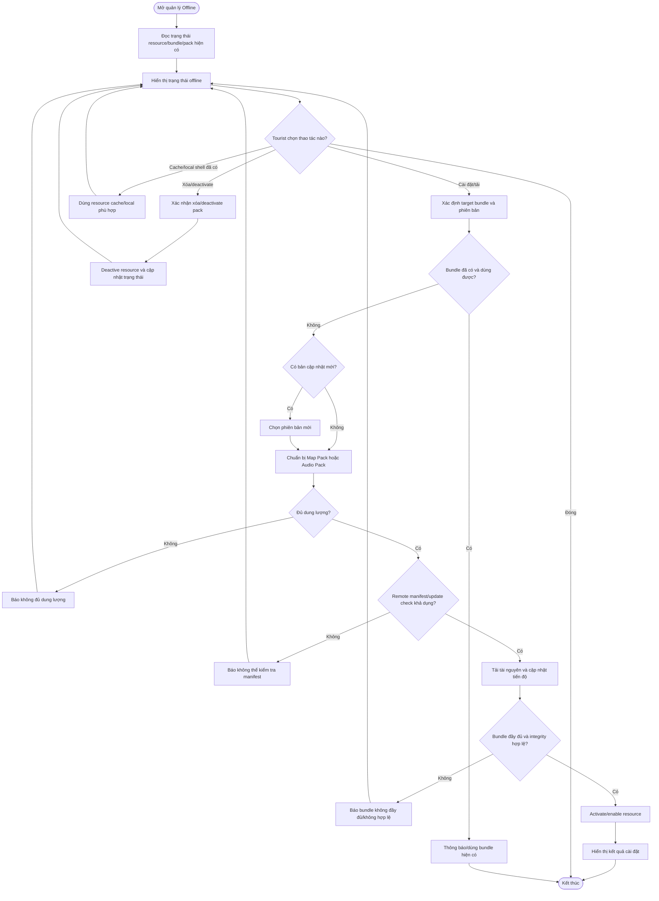

# UC09 — Quản lý dữ liệu offline

**Actor:** Tourist

```mermaid
flowchart TD
    A([Mở quản lý Offline]) --> B[Đọc trạng thái resource/bundle/pack hiện có]
    B --> C[Hiển thị trạng thái offline]
    C --> D{Tourist chọn thao tác nào?}
    D -- Cài đặt/tải --> E[Xác định target bundle và phiên bản]
    E --> F{Bundle đã có và dùng được?}
    F -- Có --> G[Thông báo/dùng bundle hiện có]
    F -- Không --> H{Có bản cập nhật mới?}
    H -- Có --> I[Chọn phiên bản mới]
    H -- Không --> J[Chuẩn bị Map Pack hoặc Audio Pack]
    I --> J
    J --> K{Đủ dung lượng?}
    K -- Không --> X[Báo không đủ dung lượng] --> C
    K -- Có --> L{Remote manifest/update check khả dụng?}
    L -- Không --> Y[Báo không thể kiểm tra manifest] --> C
    L -- Có --> M[Tải tài nguyên và cập nhật tiến độ]
    M --> N{Bundle đầy đủ và integrity hợp lệ?}
    N -- Không --> W[Báo bundle không đầy đủ/không hợp lệ] --> C
    N -- Có --> O[Activate/enable resource]
    O --> P[Hiển thị kết quả cài đặt] --> Z([Kết thúc])
    D -- Xóa/deactivate --> Q[Xác nhận xóa/deactivate pack]
    Q --> R[Deactive resource và cập nhật trạng thái] --> C
    D -- Cache/local shell đã có --> S[Dùng resource cache/local phù hợp] --> C
    D -- Đóng --> Z
    G --> Z
```

**Ngoại lệ:** Thiếu dung lượng, không truy cập được manifest/update check, hoặc bundle ở trạng thái không đầy đủ.