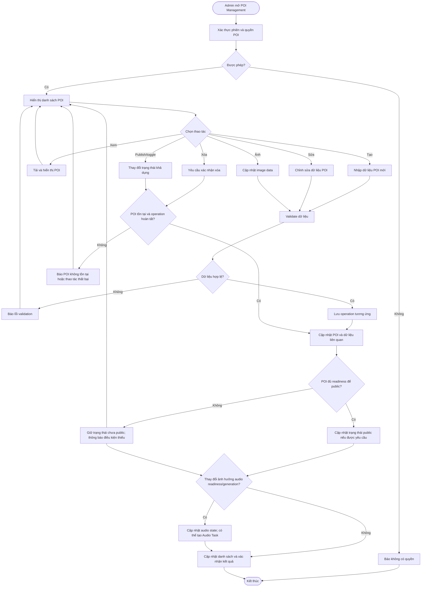

# UC10 — Quản lý POI

**Actor:** Admin

```mermaid
flowchart TD
    A([Admin mở POI Management]) --> B[Xác thực phiên và quyền POI]
    B --> C{Được phép?}
    C -- Không --> X[Báo không có quyền] --> Z([Kết thúc])
    C -- Có --> D[Hiển thị danh sách POI]
    D --> E{Chọn thao tác}
    E -- Tạo --> F[Nhập dữ liệu POI mới]
    E -- Xem --> G[Tải và hiển thị POI]
    E -- Sửa --> H[Chỉnh sửa dữ liệu POI]
    E -- Xóa --> I[Yêu cầu xác nhận xóa]
    E -- Publish/toggle --> J[Thay đổi trạng thái khả dụng]
    E -- Ảnh --> K[Cập nhật image data]
    F --> L[Validate dữ liệu]
    H --> L
    K --> L
    L --> M{Dữ liệu hợp lệ?}
    M -- Không --> N[Báo lỗi validation] --> D
    M -- Có --> O[Lưu operation tương ứng]
    I --> P{POI tồn tại và operation hoàn tất?}
    J --> P
    O --> Q[Cập nhật POI và dữ liệu liên quan]
    P -- Có --> Q
    P -- Không --> R[Báo POI không tồn tại hoặc thao tác thất bại] --> D
    Q --> S{POI đủ readiness để public?}
    S -- Không --> T[Giữ trạng thái chưa public; thông báo điều kiện thiếu] --> D
    S -- Có --> U[Cập nhật trạng thái public nếu được yêu cầu]
    U --> V{Thay đổi ảnh hưởng audio readiness/generation?}
    T --> V
    V -- Có --> W[Cập nhật audio state; có thể tạo Audio Task]
    V -- Không --> Y[Cập nhật danh sách và xác nhận kết quả]
    W --> Y
    G --> D
    Y --> Z
```

**Phạm vi:** CRUD POI, toggle/publish availability và cập nhật hình ảnh. Thay đổi POI có thể kích hoạt xử lý audio nền (UC11).