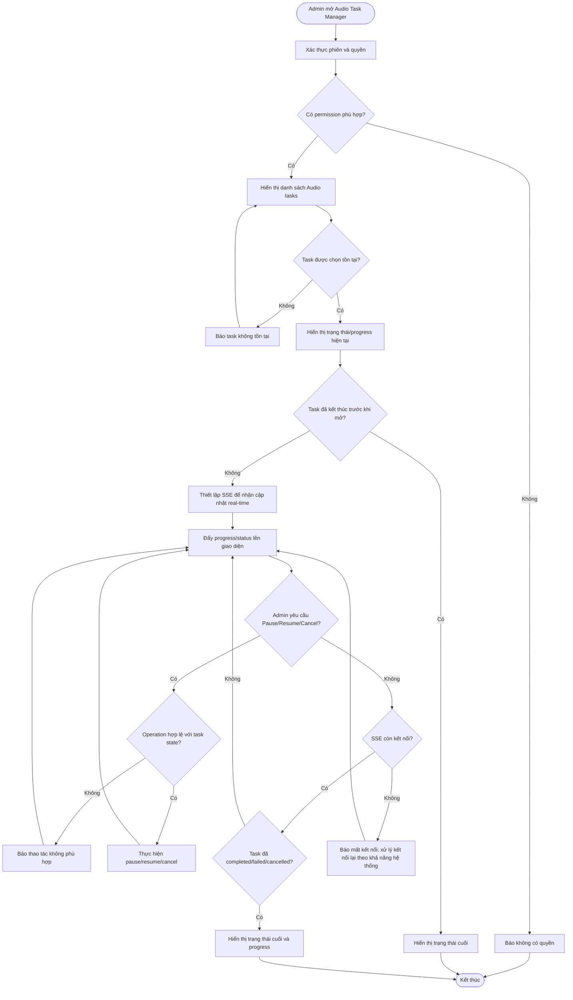

# UC11 — Giám sát tiến độ tạo Audio

**Actor:** Admin

```mermaid
flowchart TD
    A([Admin mở Audio Task Manager]) --> B[Xác thực phiên và quyền]
    B --> C{Có permission phù hợp?}
    C -- Không --> X[Báo không có quyền] --> Z([Kết thúc])
    C -- Có --> D[Hiển thị danh sách Audio tasks]
    D --> E{Task được chọn tồn tại?}
    E -- Không --> Y[Báo task không tồn tại] --> D
    E -- Có --> F[Hiển thị trạng thái/progress hiện tại]
    F --> G{Task đã kết thúc trước khi mở?}
    G -- Có --> H[Hiển thị trạng thái cuối] --> Z
    G -- Không --> I[Thiết lập SSE để nhận cập nhật real-time]
    I --> J[Đẩy progress/status lên giao diện]
    J --> K{Admin yêu cầu Pause/Resume/Cancel?}
    K -- Có --> L{Operation hợp lệ với task state?}
    L -- Không --> M[Báo thao tác không phù hợp] --> J
    L -- Có --> N[Thực hiện pause/resume/cancel] --> J
    K -- Không --> O{SSE còn kết nối?}
    O -- Có --> P{Task đã completed/failed/cancelled?}
    P -- Không --> J
    P -- Có --> Q[Hiển thị trạng thái cuối và progress]
    Q --> Z
    O -- Không --> R[Báo mất kết nối; xử lý kết nối lại theo khả năng hệ thống] --> J
```

**Ngoại lệ:** Quyền không đủ, task không tồn tại, SSE gián đoạn, task failed hoặc thao tác không phù hợp trạng thái task.