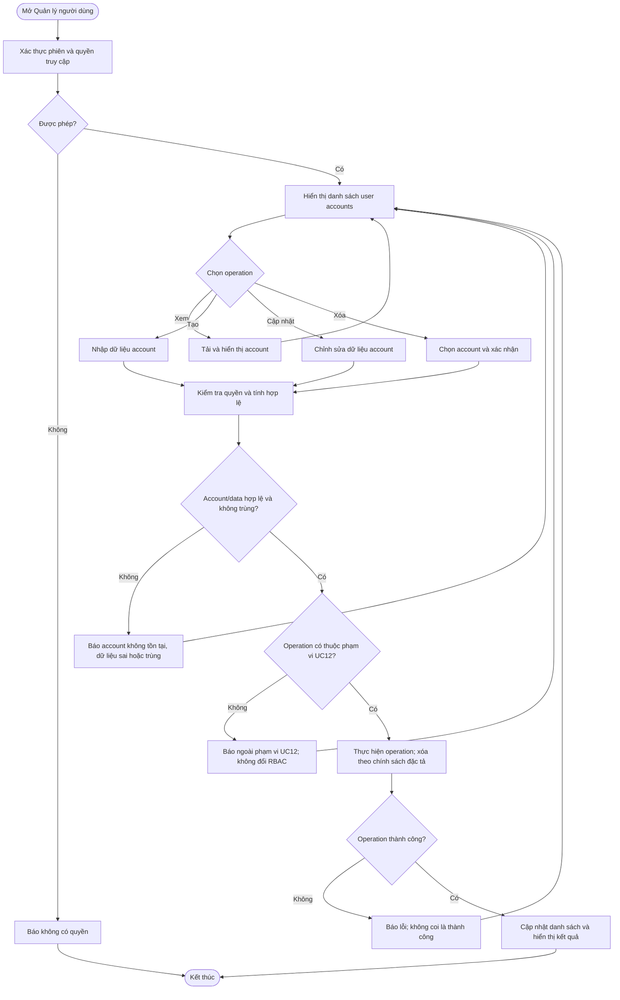

# UC12 — Quản lý tài khoản người dùng

**Actor:** Super Admin

```mermaid
flowchart TD
    A([Mở Quản lý người dùng]) --> B[Xác thực phiên và quyền truy cập]
    B --> C{Được phép?}
    C -- Không --> X[Báo không có quyền] --> Z([Kết thúc])
    C -- Có --> D[Hiển thị danh sách user accounts]
    D --> E{Chọn operation}
    E -- Xem --> F[Tải và hiển thị account]
    E -- Tạo --> G[Nhập dữ liệu account]
    E -- Cập nhật --> H[Chỉnh sửa dữ liệu account]
    E -- Xóa --> I[Chọn account và xác nhận]
    G --> J[Kiểm tra quyền và tính hợp lệ]
    H --> J
    I --> J
    J --> K{Account/data hợp lệ và không trùng?}
    K -- Không --> L[Báo account không tồn tại, dữ liệu sai hoặc trùng] --> D
    K -- Có --> M{Operation có thuộc phạm vi UC12?}
    M -- Không --> N[Báo ngoài phạm vi UC12; không đổi RBAC] --> D
    M -- Có --> O[Thực hiện operation; xóa theo chính sách đặc tả]
    O --> P{Operation thành công?}
    P -- Không --> Q[Báo lỗi; không coi là thành công] --> D
    P -- Có --> R[Cập nhật danh sách và hiển thị kết quả] --> Z
    F --> D
```

**Ranh giới:** Quản lý account người dùng; không đưa việc thay đổi role/permission vào UC12 (thuộc UC14).