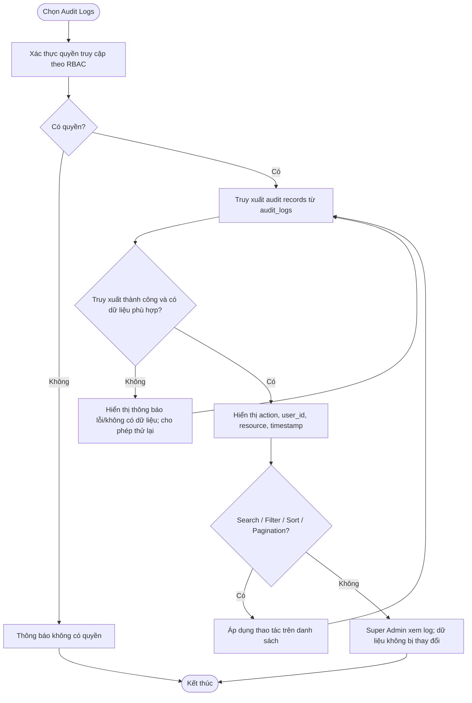

# UC16 — Xem Audit Log

**Actor:** Super Admin

```mermaid
flowchart TD
    A([Chọn Audit Logs]) --> B[Xác thực quyền truy cập theo RBAC]
    B --> C{Có quyền?}
    C -- Không --> X[Thông báo không có quyền] --> Z([Kết thúc])
    C -- Có --> D[Truy xuất audit records từ audit_logs]
    D --> E{Truy xuất thành công và có dữ liệu phù hợp?}
    E -- Không --> F[Hiển thị thông báo lỗi/không có dữ liệu; cho phép thử lại] --> D
    E -- Có --> G[Hiển thị action, user_id, resource, timestamp]
    G --> H{Search / Filter / Sort / Pagination?}
    H -- Có --> I[Áp dụng thao tác trên danh sách] --> D
    H -- Không --> J[Super Admin xem log; dữ liệu không bị thay đổi]
    J --> Z([Kết thúc])
```

**Giới hạn:** Có search, filter, sort và pagination; không có detail view, export, xóa log hoặc cấu hình audit trong UC16.