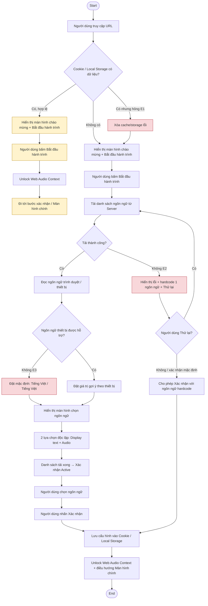

# UC01 — Khởi động & Chọn ngôn ngữ

**Chú giải**
- Luồng chính: truy cập → kiểm tra storage → tải/nhận diện ngôn ngữ → chọn → xác nhận → lưu → Màn hình chính.
- Luồng rẽ nhanh A1: người dùng cũ có cấu hình hợp lệ bỏ qua chọn ngôn ngữ.
- Ngoại lệ E1: storage hỏng → xóa dữ liệu → xử lý như người dùng mới.
- Ngoại lệ E2: lỗi tải API → thông báo + thử lại; nếu vẫn không thành công cho phép xác nhận với ngôn ngữ hardcode.
- Ngoại lệ E3: ngôn ngữ thiết bị không hỗ trợ → mặc định Tiếng Việt.
