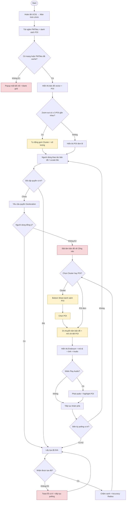

# UC02 — Khám phá bản đồ tương tác

**Chú giải**
- Luồng chính: tải dữ liệu → bản đồ → quyền/vị trí → chọn POI → chi tiết → audio.
- Luồng rẽ nhanh A1: Cluster → danh sách POI → chọn POI → chi tiết.
- Luồng rẽ nhanh A2: polling định kỳ để cập nhật vị trí.
- Ngoại lệ E1: offline và chưa có PMTiles cache → blank grid.
- Ngoại lệ E2: từ chối GPS → tâm bản đồ về Cổng vào.
- Ngoại lệ E3: không lấy được tọa độ → thông báo và tiếp tục polling ngầm.
