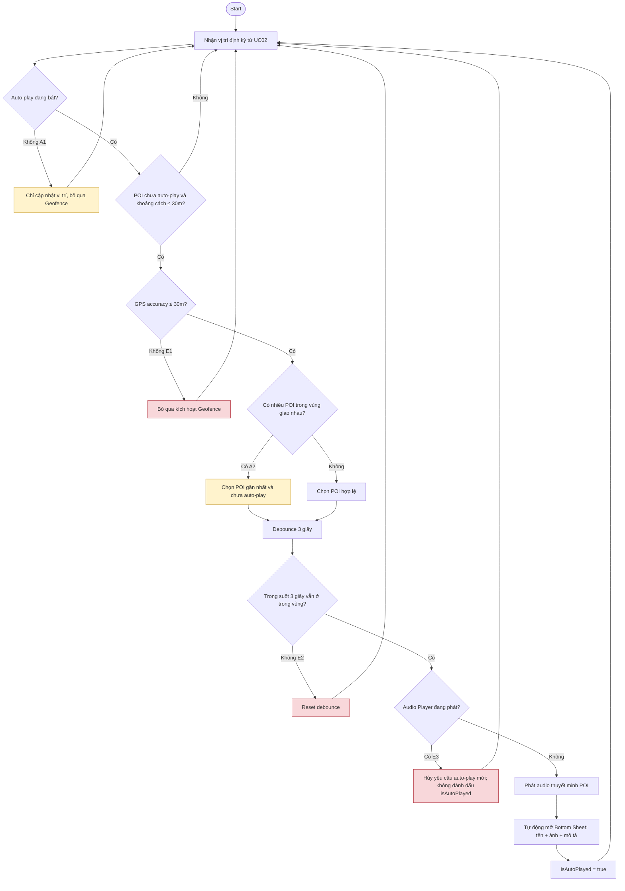

# UC03 — Nhận thuyết minh tự động theo Geofence

**Chú giải**
- Luồng chính: vị trí → bán kính/accuracy → debounce 3 giây → kiểm tra audio → phát → Bottom Sheet → isAutoPlayed.
- Luồng rẽ nhanh A1: Auto-play Off → không kiểm tra debounce và không tự phát.
- Luồng rẽ nhanh A2: Geofence chồng lấn → chọn POI gần nhất chưa phát.
- Ngoại lệ E1: accuracy > 30m → bỏ qua kích hoạt.
- Ngoại lệ E2: GPS trôi ra khỏi vùng trong debounce → reset; vào lại thì đếm lại 3 giây.
- Ngoại lệ E3: đang phát audio khác → hủy auto-play mới và không đặt isAutoPlayed.
